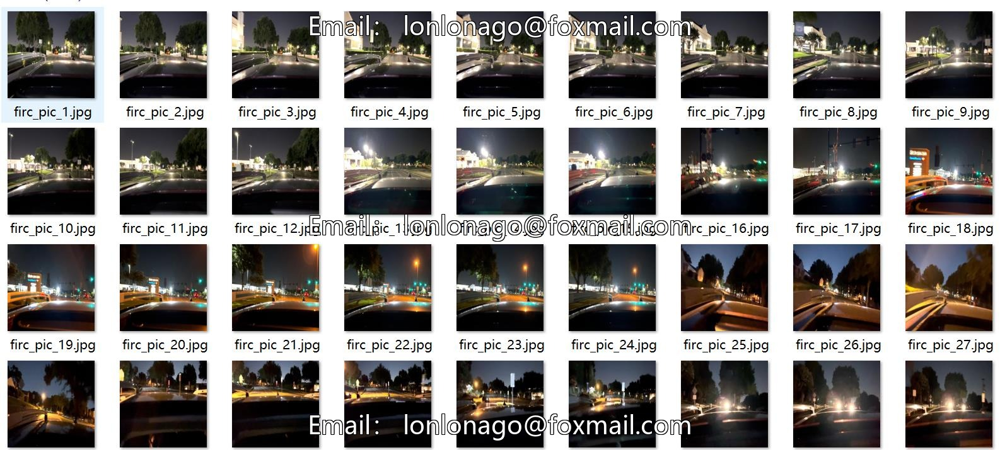
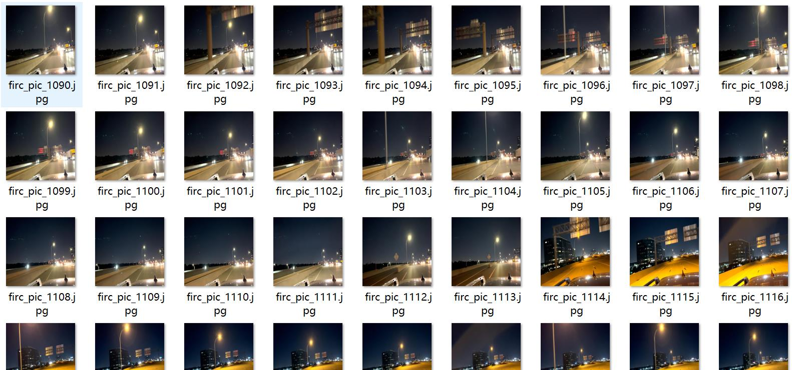
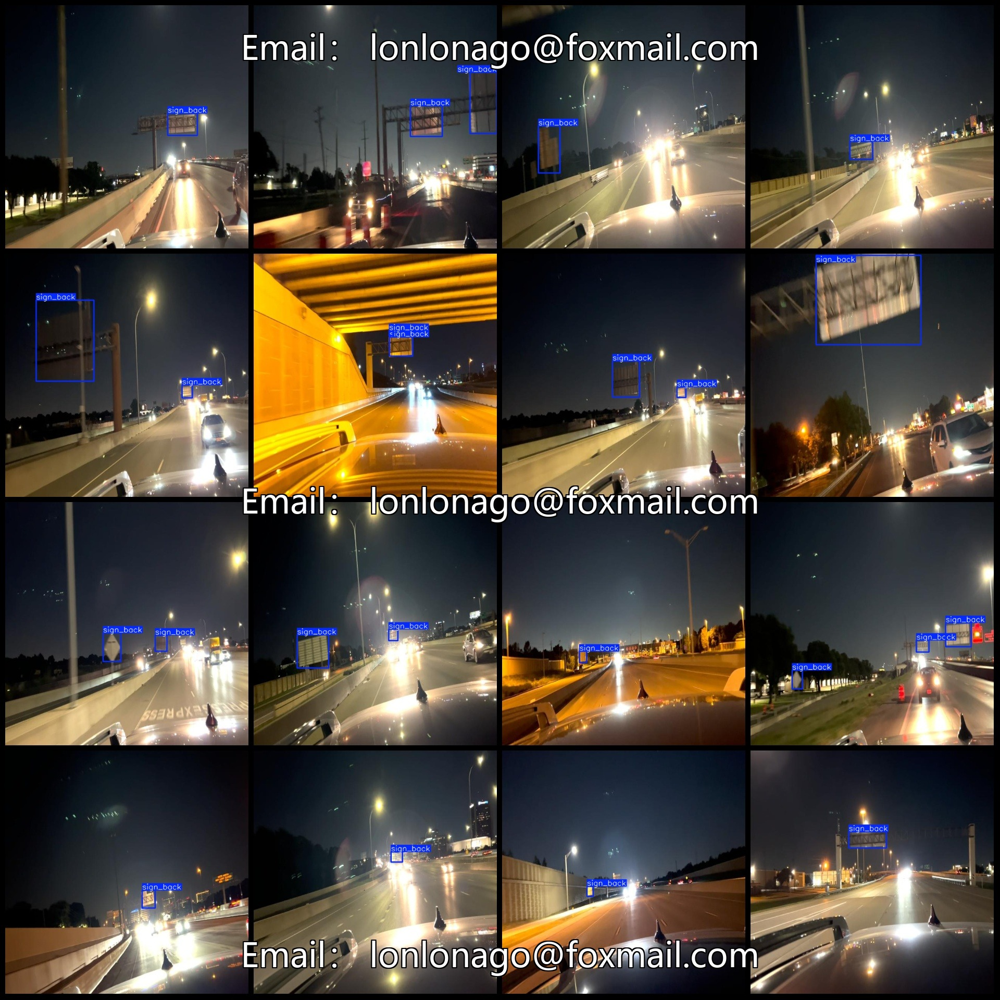
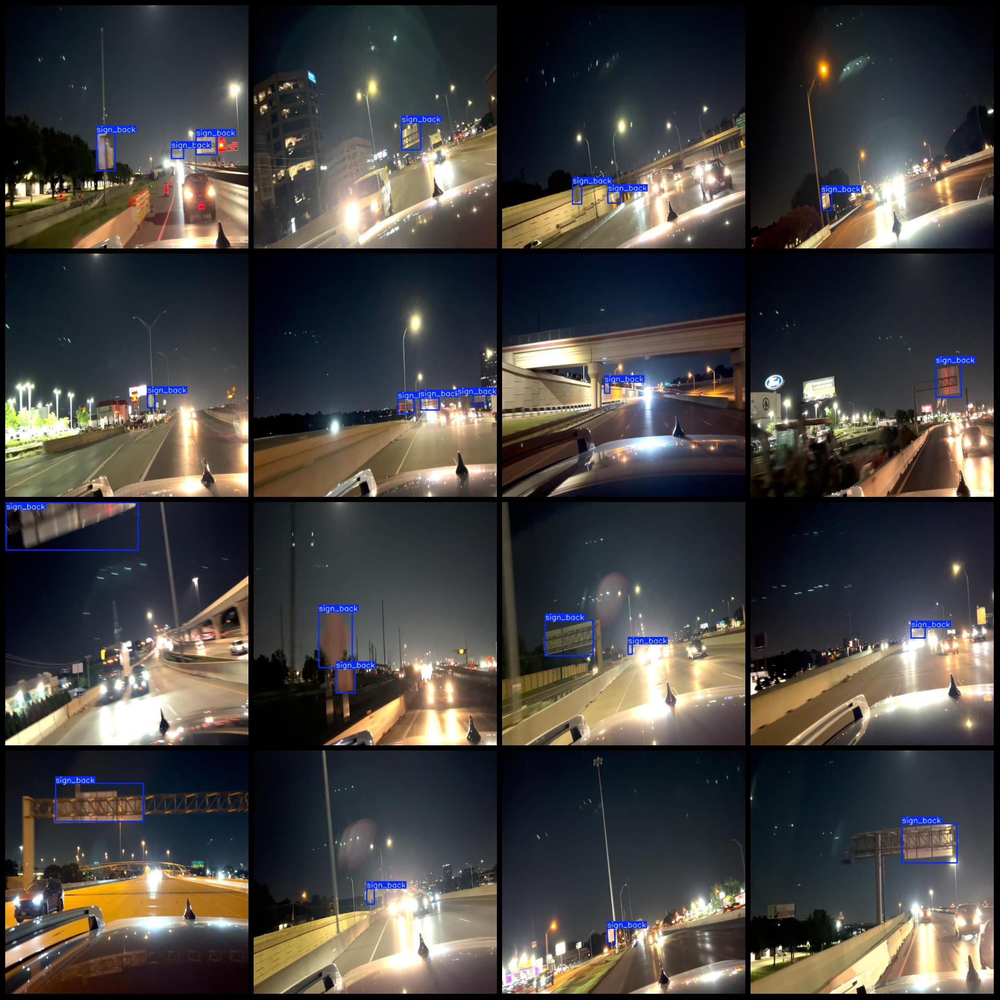

# Vehicles in Autonomous Driving Scenes: Night Driving Reverse Checking Dataset VOC+YOLO format with 1 category, 1384 images

Dataset format: Pascal VOC format + YOLO format (excluding split paths, only containing jpg images and corresponding VOC format xml files and yolo format txt files)
1384
The number of XML files is 1384.
annotation count: 1384  
annotationnumber of classes: 1  
annotation class names:["sign_back"]  
The number of boxes annotated in each category:
The question seems to be asking for the number of sign-backs in a binary tree, which is 2119. However, there seems to be a misunderstanding or confusion in the question. A "sign-back" in the context of binary trees refers to the number of nodes in a subtree with exactly one child. The number of sign-backs in a binary tree can be calculated using the formula:

$N_{sign\_back} = \frac{N_{total}}{2}$

where $N_{total}$ is the total number of nodes in the tree and $N_{sign\_back}$ is the number of sign-backs.

In this case, if we know that the number of nodes in the entire tree is 2119, then the number of sign-backs would be:

$N_{sign\_back} = \frac{2119}{2} = 1059.5$

However, it's important to note that the actual number of sign-backs may not be an integer, as some nodes may have more than one child. In practice, you would need to calculate the exact number of sign-backs for each node in the tree to get a complete picture.
total boxes: 2119  
Number of images per category:
The number of signed back images is 1384.
image resolution: 640x640  
Use annotation tool: labelImg  
Annotation rules: draw a rectangle box around the class  
Important notes: Dataset has not been divided into training, validation, and test sets. You need to divide it yourself.  
Special statement: This dataset does not guarantee the accuracy of the trained model or the weight file.  
Image preview:
## Images

Here is a pay link on Stripe ( https://buy.stripe.com/3cs8yP7sY87d0vu9AB ). Please contact me lonlonago@foxmail.com after funding $89, and I will send you a complete data files , thank you!

